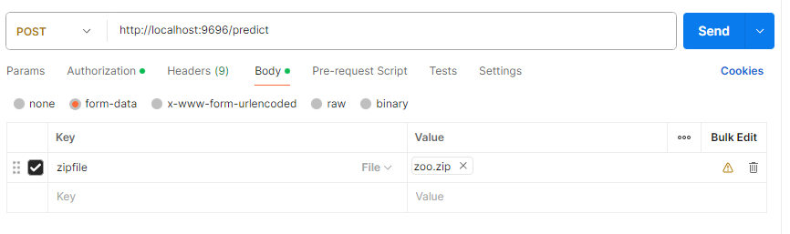

# Dataset

I will use a dataset containing images of various animals: https://www.kaggle.com/datasets/grassknoted/asl-alphabet. I will get the training and validation data trough kaggle API. I plan to download and check for updates uning the Kaggle API. The API allows you to only dowload the metadata. That way, I can easily check for updates in the dataset.

# Project Explanation

The goal of this project is to develop a machine learning model capable of interpreting sign language. I want to make i so the model and web server support batch processing, so you can make a word in sign language and the model will respond with an estimateof that word.

# Flows & Actions

## Collect Flow

Tasks involved in the Collect flow:

1. **Load Dataset Metadata**: Utilize the Kaggle API to retrieve metadata of the dataset.
2. **Check Dataset Status**: Verify if the dataset exists locally and whether the local version is outdated compared to the version on Kaggle.
3. **Download Dataset**: Load the dataset from Kaggle onto the local disk.
4. **Extract Dataset**: Unpack the dataset files ready for preprocessing.

## Prep Flow

Tasks involved in the Prep flow:

1. **Read Data**: Load the dataset from the directory where it was extracted.
2. **Cache Data**: Cache the dataset to optimize loading times for TensorFlow processing.

## HPO (Hyper Parameter Optimization) Flow

Tasks involved in the HPO flow:

1. **Perform HPO**: Execute hyperparameter optimization to enhance model performance.

## Register Flow

Tasks involved in the Register flow:

1. **Train and Log Model**: Conduct model training while logging performance metrics.
2. **Experiment Runs**: Collect data from various training runs.
3. **Model Selection**: Choose the best performing model based on the metrics.

# Start project:

! if any of the sh scripts do not work, run: **sed -i 's/\r$//' [name_of_scirpt]** and then run the script again, or just copy the commands from inside the script.

1. Clone in container volume
2. Wait for packages to install
3. Go to the exercise directory and run the script 'servers.sh'
4. Make a local process pool callded local_pool in the prefect ui
5. Open new terminal and run: 'prefect deploy'
6. Select the main-deployment
7. Start a worker with command: prefect worker start --pool 'local_pool'
8. Run the deployment
9. Start the webserver by running 'web-service.sh'
10. Make a POST to http://localhost:9696/predict with form-data. Key: zipfile OR image. Value: a zipfile with multiple .jpg images OR a single jpg
    
11. Go the monitoring and run the python script monitoring.py. This takes the data uploaded to the webserver as reference data for calculating the metrics.
12. Open grafana, go to import a dashboard, and copy the contents of dashboards/test.json.
